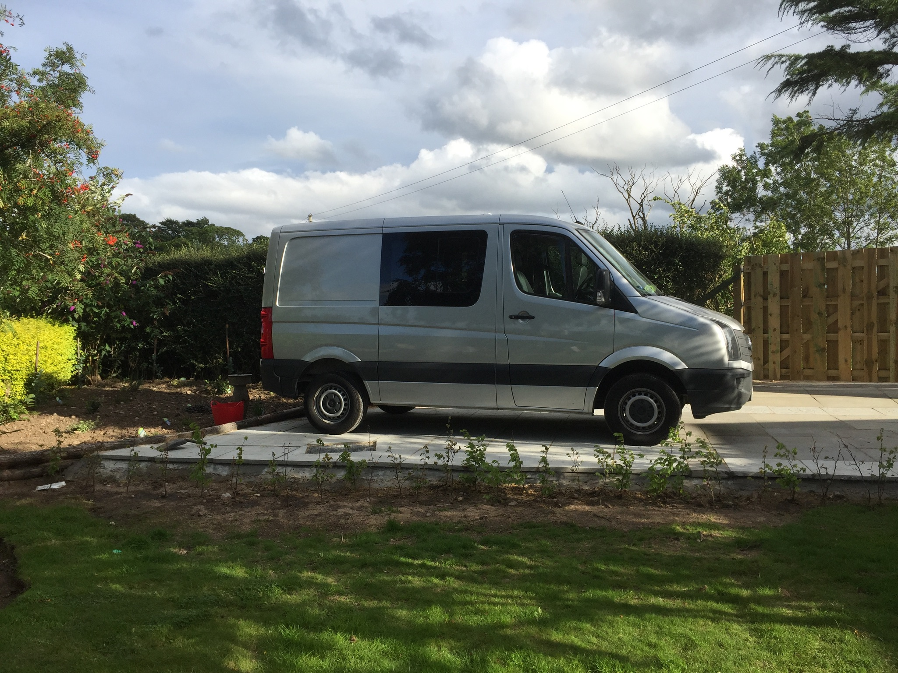

# FOR SALE - VW Crafter Campervan

**£22,000 o.n.o.**

My custom-built campervan based on 2013 VW Crafter. Short wheelbase, low-roof.

## Contact

I can be contacted by email at [lee.dyson+VAN@gmail.com](mailto://lee.dyson+VAN@gmail.com).

Happy to answer any questions you may have before you come to look.

I'm located 2 miles outside Forres in the north of Scotland, approx 27 miles from Inverness, 12 miles from Elgin on A96. Van can be viewed by arrangement.

## Base Vehicle

+ VW Crafter CR35
+ Reflex Silver
+ 58,000 miles
+ 2.0l Diesel
+ MOT till June 2022
+ Full service history with [GLM Motors](https://www.glmmotors.net/) in Elgin

This model of Crafter is effectivley a Mercedes Sprinter with a VW engine. It shares **MOST** parts with a Sprinter of the same age. I bought many of the parts for this conversion from Mercedes commercials in Nairn.

## Camper

This camper was my project in 2014-2015, professionally converted by Neil @ Happy Highland Campervans in Inverness.

As a vehicle, it's the same length as a VW T5. It's based on the Crafter so it's a bit boxier, and there's more room internally (e.g. wider bed at 1.3m)

No-expense was spared during the creation of this van, but I'm not using it as much as I once did, so I'm selling this to help fund my next project.

This is the *LOW ROOF* - Me & the misssus are vertically challenged, so not a problem for us... If you're 6-foot-6 this is probably not the camper you're looking for.

Vehicle has very recent MOT, and will be serviced, and fully valeted before sale.

Van is registered with DVLA as _Motorcaravan_ therefore _CAR_ speed limits.

### Vehicle
+ Single passenger seat
+ Driver's & Passenger swivel seats.
+ Correct mats + carpets to accommodate single passenger seat
+ Official Mercedes head-lining + internal trim.
+ Mercedes black alloy Wheels
+ Good quality Pioneer head-unit (Apple play - Sat Nav etc.)
+ Tow-bar  + Cruise control retro-fitted by VW Inverness.

### Insulation

Van was insulated with Thermoliner, natural sheep's wool, and flashband.

### Electrics

+ 110Ah Leisure Battery
+ 2 x 100w Solar Panels to roof
+ MPPT Solar controller.
+ 3 x 240v Mains (when on hookup)
+ 2 x USB sockets
+ LED lighting throughout
+ Touch-on LED ligts to rear
+ LED reading lights over bed
+ Mains battery charger under passenger seat
+ Mains hook-up under bonnet
+ Split-charger

### Heating

+ Eberspacher D2 diesel heater - **NOT** cheap chinese clone.

### Appliances

+  Thetford 2 burner Hob + Grill
+  Top-loading vitrifrigo compressor fridge
+  Fire Extinguisher
+  Smoke + Carbon monoxide detector

### Furniture

+ Custom built furniture in Voehringer board
+ Custom made rock-n-roll bed from Cannons Forge. - Approx 6'6" long, approx 4'" wide

## Photos

Lots of photos [here](https://www.icloud.com/sharedalbum/#B11Gf693ZGpiUDZ)

## Shopping List

The attached Google sheet gives details of everything I spent bulding this vehicle.

[See Here](https://docs.google.com/spreadsheets/d/1u1e6D8Eon_hKz2p8mEipF_9oJBkhiUrPWwAVnNexj8k/edit?usp=sharing)

## The Bad News.

+ A few minor scratches to paintwork.
+ Small rust-bubble (1.5") on door runner.
+ Probably due new belts
